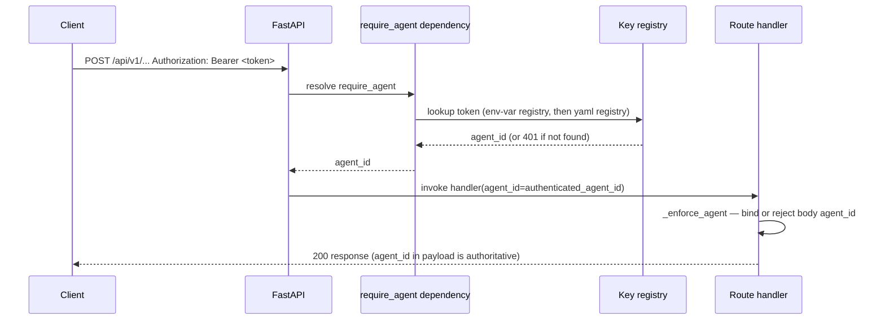
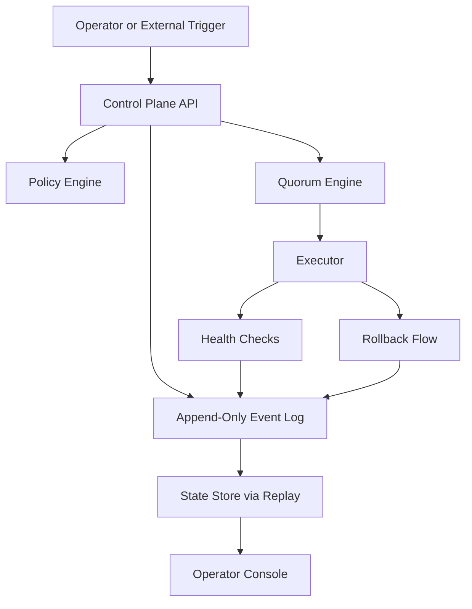
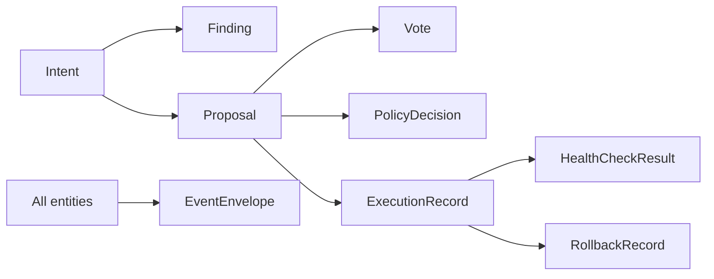
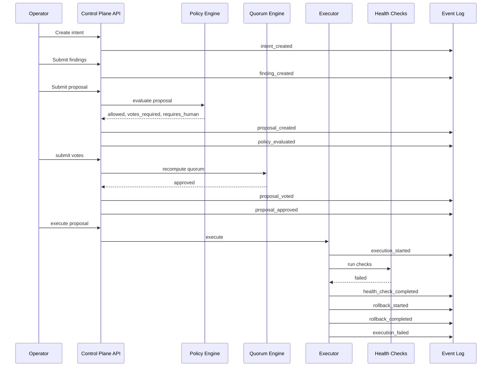

# Architecture

This document describes the POC architecture in a format that is intentionally easy for both humans and LLMs to parse.

## System goal

Quorum coordinates multiple agents that inspect system state, propose actions, reach quorum, and execute safely with verification and rollback.

## Core control loop

```text
observe -> find -> propose -> policy-check -> vote -> approve -> execute -> verify -> rollback-if-needed -> log everything
```

## Main components

1. **Control Plane API**
   - accepts intents, findings, proposals, votes, and execution requests
   - exposes state and event history

2. **Append-Only Event Log**
   - source of truth
   - every state transition becomes an event
   - **tamper-evident hash chain**: each `EventEnvelope` carries `prev_hash` and
     `hash` (sha256 of the canonical JSON of
     `{id, event_type, entity_type, entity_id, ts, payload, prev_hash}`).
     Startup runs `EventLog.verify()` and refuses to boot on a broken chain.
     `GET /api/v1/events/verify` re-walks the chain on demand.
   - replayable

3. **State Store**
   - rebuilds current state from the log
   - used by API and console

4. **Policy Engine**
   - checks whether a proposal is allowed
   - decides whether human approval is required
   - decides required quorum size

5. **Quorum Engine**
   - counts votes
   - marks proposals approved or blocked

6. **Executor**
   - runs an approved proposal
   - evaluates health checks via a registered-kind dispatcher (no subprocess path)
   - triggers rollback when needed

   Supported `HealthCheckKind` values: `always_pass`, `always_fail`, `http`
   (HTTP GET/HEAD probe with expected-status and timeout). Adding a new probe
   requires extending the enum and adding a branch in `services/health_checks.py`
   — proposals cannot inject arbitrary command strings.

7. **Operator Console**
   - shows intents, proposals, votes, execution state, and log events

8. **Observability**
   - `/metrics` endpoint exposes Prometheus-format histograms and counters via
     `prometheus-fastapi-instrumentator`
   - public (no auth) so external Prometheus scrapers can reach it
   - excluded from rate limiting and from its own self-scrape counter
   - not bundled — a separate Prometheus server is expected to scrape it
   - pairs with structured JSON logs (`apps/api/app/logging_config.py`) and
     per-request `X-Request-ID` headers (`apps/api/app/request_context.py`)
     for end-to-end tracing

   **Distributed tracing (OpenTelemetry)**
   - `apps/api/app/tracing.py` exposes a single `configure_tracing(app)` function
     called at startup
   - export is **off by default in development** — tracing activates only when
     `OTEL_EXPORTER_OTLP_ENDPOINT` is set; if the variable is absent or empty the
     function returns immediately with no side effects and no warnings
   - when enabled, spans are exported via OTLP/HTTP to the configured collector
     endpoint and batched through `BatchSpanProcessor`
   - service name and additional resource attributes are read from standard OTEL
     env vars: `OTEL_SERVICE_NAME` (default `"quorum"`) and
     `OTEL_RESOURCE_ATTRIBUTES` (pass-through to the SDK's `Resource.create()`)
   - `/metrics` and `/health` are excluded from tracing to prevent Prometheus
     scrapes and liveness probes from polluting trace data
   - `X-Request-ID` set by `RequestContextMiddleware` is also bound into
     structlog's context, so traces and logs share a common request identifier
     that can be used to cross-reference spans and log lines in an observability
     platform (full log-span correlation wiring is a follow-up)

## Authentication and actor identity

### Overview

Every mutating route requires a bearer token.
Read-only routes stay public so the console and liveness probes work without credentials.

Public (no auth):
- `GET /api/v1/health`
- `GET /api/v1/state`
- `GET /api/v1/events`
- `GET /api/v1/events/verify`

Auth-required (all mutating `POST` routes):
- `POST /api/v1/intents`
- `POST /api/v1/findings`
- `POST /api/v1/proposals`
- `POST /api/v1/votes`
- `POST /api/v1/proposals/{proposal_id}/execute`
- `POST /api/v1/demo/incident`

### Key registry (Phase 2 MVP)

Keys are loaded once on process start from the env var `QUORUM_API_KEYS`.
Format: `agent_id:plaintext_key,agent_id:plaintext_key,...`
The registry is a dict of `{plaintext_key: agent_id}` held in memory.
Matching uses `hmac.compare_digest` to prevent timing-based key inference.

Phase 2.5 adds argon2id-hashed keys stored in `config/agents.yaml` as a second registry, checked after the env-var registry (see PR #TBD).

### Demo endpoint gate

`POST /api/v1/demo/incident` additionally requires `QUORUM_ALLOW_DEMO=1` (or `true`, `yes`, `on`).
If the env var is absent or falsy, the route returns 404.
This prevents accidental demo resets in production deployments.

### Server-side actor binding (PR #14)

The authenticated `agent_id` returned by `require_agent` is always authoritative.

Rules enforced by `_enforce_agent` in `apps/api/app/api/routes.py`:
- If the request body includes an `agent_id` that differs from the authenticated agent, the server returns 403.
- If the request body omits `agent_id` (or sends an empty string), the server fills it in with the authenticated agent.
- For `POST /api/v1/intents`, `requested_by` is always overwritten with the authenticated agent regardless of what the client sends.
- For `POST /api/v1/proposals/{proposal_id}/execute`, the body's `actor_id` field is ignored; the authenticated agent is used.

This closes the spoof surface: a valid key for agent A cannot claim authorship as agent B.

### What auth is NOT

- No JWT.
- No session cookies.
- No OAuth.
- No per-request re-auth against an external IdP.
- Human-operator login via GitHub OAuth is planned for Phase 4.

### Auth flow diagram



## Readable architecture diagram



## Data model diagram



## Event flow for an incident rollback



## POC design decisions

### 1. Event log first
The log is the source of truth.
The state store is derived.

### 2. No free-form execution
Execution only happens through a typed proposal.

### 3. Policy before quorum before execution
That ordering is fixed.

### 4. Verification determines success
Execution is not success.
Passing health checks is success.

### 5. Rollback is not optional
A proposal should carry rollback steps or clearly declare why rollback is impossible.

## Extension points

Later layers can plug in here:

- real LLM agent adapters
- GitHub actuators
- Kubernetes actuators
- Terraform actuators
- approval workflows
- durable DB-backed storage
- authenticated operators
- policy DSL
- richer consensus models

## What not to change casually

These are load-bearing:

- append-only event log
- typed proposals
- policy + quorum gating
- health-based success
- rollback as a first-class path
