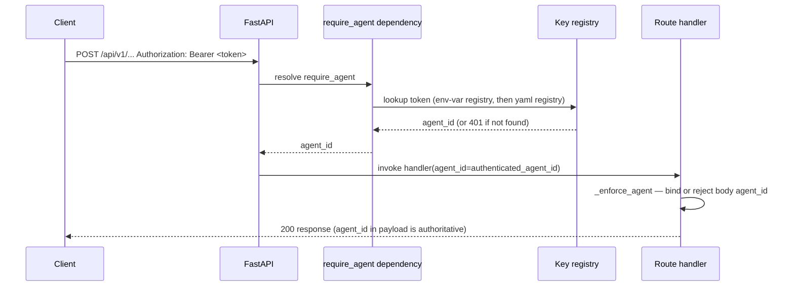
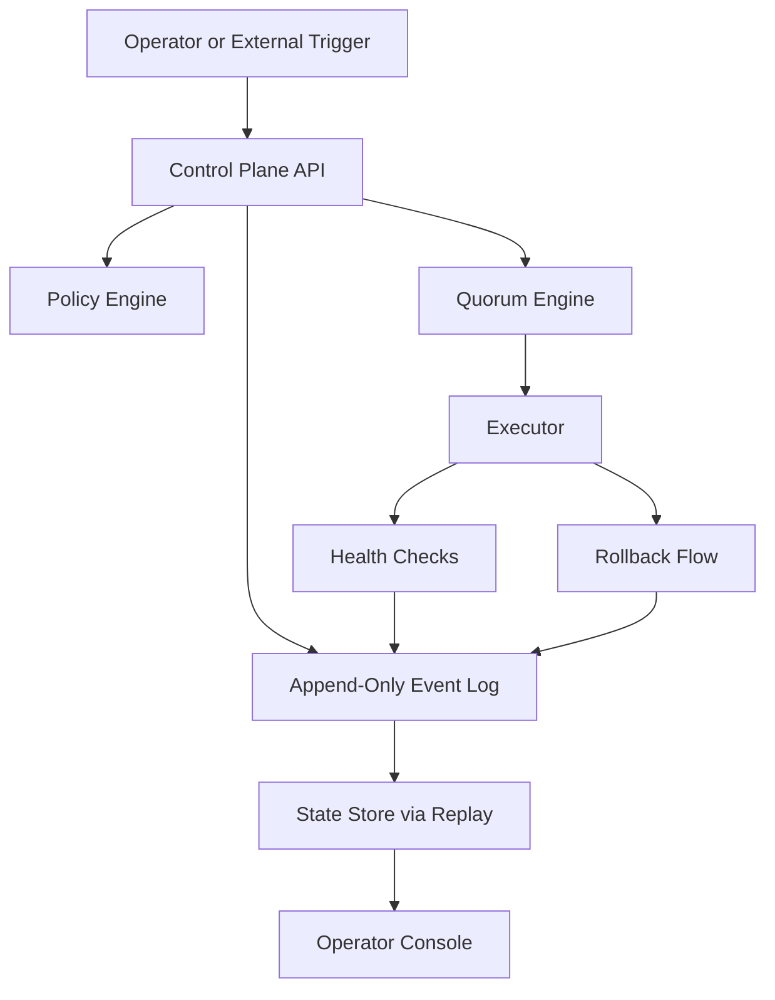
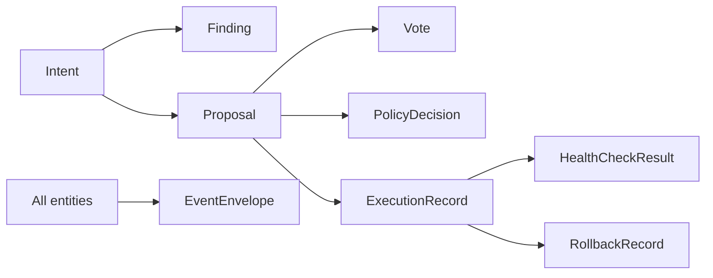
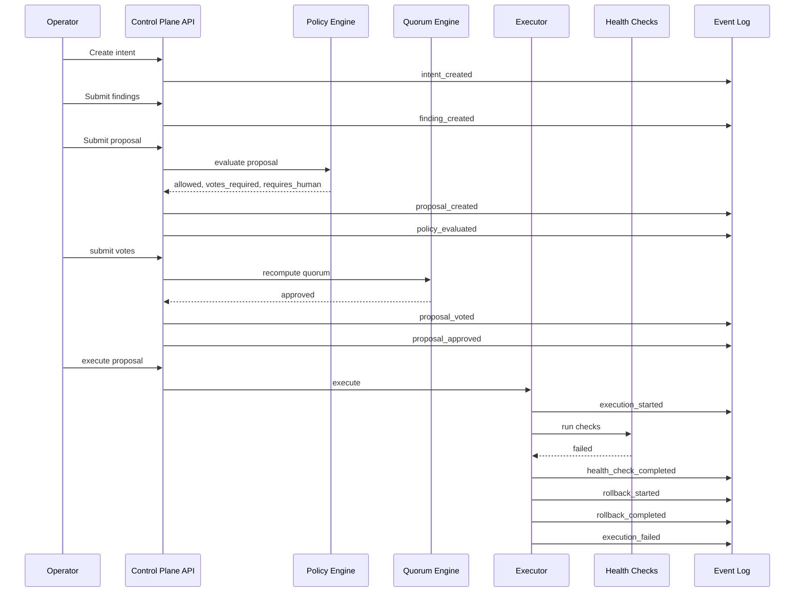

# Architecture

This document describes the POC architecture in a format that is intentionally easy for both humans and LLMs to parse.

## System goal

Quorum coordinates multiple agents that inspect system state, propose actions, reach quorum, and execute safely with verification and rollback.

## Core control loop

```text
observe -> find -> propose -> policy-check -> vote -> approve -> execute -> verify -> rollback-if-needed -> log everything
```

## Main components

1. **Control Plane API**
   - accepts intents, findings, proposals, votes, and execution requests
   - exposes state and event history

2. **Append-Only Event Log**
   - source of truth
   - every state transition becomes an event
   - **tamper-evident hash chain**: each `EventEnvelope` carries `prev_hash` and
     `hash` (sha256 of the canonical JSON of
     `{id, event_type, entity_type, entity_id, ts, payload, prev_hash}`).
     Startup runs `EventLog.verify()` and refuses to boot on a broken chain.
     `GET /api/v1/events/verify` re-walks the chain on demand.
   - replayable
   - **Projector hook**: after every successful append, `EventLog` calls
     `projector.apply(event)` with the enriched envelope. `NoOpProjector`
     is the default; when `DATABASE_URL` is set, `PostgresProjector` writes
     the event and its derived entity row via `INSERT ... ON CONFLICT`
     upserts. A projector failure is logged and swallowed — the JSONL
     write is never reverted. See `docs/design/postgres-projection.md`.
   - **Reconciliation**: `python -m apps.api.app.tools.reconcile` re-applies
     the full JSONL to the projection (idempotent, order-preserving).
     Useful after a projector outage or when bringing up a fresh PG.

3. **State Store**
   - rebuilds current state from the log (replay-based, in-memory)
   - used by `/api/v1/state` and `/api/v1/events` — always available,
     no external dependencies

4. **Postgres projection (optional read-model)**
   - activated when `DATABASE_URL` is set
   - upserted row-per-entity; keyed on natural `<prefix>_<12hex>` IDs
   - consumed by the `/api/v1/history/*` endpoints for query-friendly
     reads (filter by agent, status, environment, etc. with pagination);
     history endpoints return **503** when `DATABASE_URL` is unset
   - eventually consistent with the JSONL — writes always go through
     `EventLog.append` first, and the JSONL stays authoritative

5. **Policy Engine**
   - checks whether a proposal is allowed
   - decides whether human approval is required
   - decides required quorum size

6. **Quorum Engine**
   - counts votes
   - marks proposals approved or blocked

7. **Executor**
   - runs an approved proposal
   - evaluates health checks via a registered-kind dispatcher (no subprocess path)
   - triggers rollback when needed

   Supported `HealthCheckKind` values: `always_pass`, `always_fail`, `http`
   (HTTP GET/HEAD probe with expected-status and timeout). Adding a new probe
   requires extending the enum and adding a branch in `services/health_checks.py`
   — proposals cannot inject arbitrary command strings.

8. **Operator Console**
   - shows intents, proposals, votes, execution state, and log events

9. **Observability**
   - `/metrics` endpoint exposes Prometheus-format histograms and counters via
     `prometheus-fastapi-instrumentator`
   - public (no auth) so external Prometheus scrapers can reach it
   - excluded from rate limiting and from its own self-scrape counter
   - not bundled — a separate Prometheus server is expected to scrape it
   - pairs with structured JSON logs (`apps/api/app/logging_config.py`) and
     per-request `X-Request-ID` headers (`apps/api/app/request_context.py`)
     for end-to-end tracing

   **Distributed tracing (OpenTelemetry)**
   - `apps/api/app/tracing.py` exposes a single `configure_tracing(app)` function
     called at startup
   - export is **off by default in development** — tracing activates only when
     `OTEL_EXPORTER_OTLP_ENDPOINT` is set; if the variable is absent or empty the
     function returns immediately with no side effects and no warnings
   - when enabled, spans are exported via OTLP/HTTP to the configured collector
     endpoint and batched through `BatchSpanProcessor`
   - service name and additional resource attributes are read from standard OTEL
     env vars: `OTEL_SERVICE_NAME` (default `"quorum"`) and
     `OTEL_RESOURCE_ATTRIBUTES` (pass-through to the SDK's `Resource.create()`)
   - `/metrics` and `/health` are excluded from tracing to prevent Prometheus
     scrapes and liveness probes from polluting trace data
   - `X-Request-ID` set by `RequestContextMiddleware` is bound into structlog's
     context so every JSON log line carries it; when a valid OTel span is
     active, `trace_id` (32-hex) and `span_id` (16-hex) are also bound into
     structlog contextvars, so JSON log events and OTLP spans can be joined
     by trace id after the fact. The bind is conditional: with tracing off,
     no trace fields appear in the log — dev output stays clean.

## Authentication and actor identity

### Overview

Every mutating route requires a bearer token.
Read-only routes stay public so the console and liveness probes work without credentials.

Public (no auth):
- `GET /api/v1/health`
- `GET /api/v1/state`
- `GET /api/v1/events`
- `GET /api/v1/events/verify`

Auth-required (all mutating `POST` routes):
- `POST /api/v1/intents`
- `POST /api/v1/findings`
- `POST /api/v1/proposals`
- `POST /api/v1/votes`
- `POST /api/v1/proposals/{proposal_id}/execute`
- `POST /api/v1/demo/incident`

### Key registry (Phase 2 MVP)

Keys are loaded once on process start from the env var `QUORUM_API_KEYS`.
Format: `agent_id:plaintext_key,agent_id:plaintext_key,...`
The registry is a dict of `{plaintext_key: agent_id}` held in memory.
Matching uses `hmac.compare_digest` to prevent timing-based key inference.

Phase 2.5 adds argon2id-hashed keys stored in `config/agents.yaml` as a second registry, checked after the env-var registry (see PR #TBD).

### Demo endpoint gate

`POST /api/v1/demo/incident` additionally requires `QUORUM_ALLOW_DEMO=1` (or `true`, `yes`, `on`).
If the env var is absent or falsy, the route returns 404.
This prevents accidental demo resets in production deployments.

### Server-side actor binding (PR #14)

The authenticated `agent_id` returned by `require_agent` is always authoritative.

Rules enforced by `_enforce_agent` in `apps/api/app/api/routes.py`:
- If the request body includes an `agent_id` that differs from the authenticated agent, the server returns 403.
- If the request body omits `agent_id` (or sends an empty string), the server fills it in with the authenticated agent.
- For `POST /api/v1/intents`, `requested_by` is always overwritten with the authenticated agent regardless of what the client sends.
- For `POST /api/v1/proposals/{proposal_id}/execute`, the body's `actor_id` field is ignored; the authenticated agent is used.

This closes the spoof surface: a valid key for agent A cannot claim authorship as agent B.

### What auth is NOT

- No JWT.
- No session cookies.
- No OAuth.
- No per-request re-auth against an external IdP.
- Human-operator login via GitHub OAuth is planned for Phase 4.

### Auth flow diagram



## Readable architecture diagram



## Data model diagram



## Event flow for an incident rollback



Rollback has two terminal variants:

- `rollback_completed` — steps were applied (text-only path) or the
  actuator successfully undid its mutation (e.g. closed the PR,
  deleted the branch).
- `rollback_impossible` — the mutation happened, rollback was
  attempted, but the state could not be restored (e.g. the PR was
  merged out-of-band). The proposal ends in
  `ProposalStatus.rollback_impossible` and a human must reconcile.

## Actuators

An **actuator** is an adapter that turns an approved proposal into a
real-world mutation against a specific external system. As of Phase 4,
the only built-in actuator is **GitHub** (`apps/api/app/services/actuators/github/`).

Contract:

- Each supported action is a string key on `Proposal.action_type`
  (`github.open_pr`, `github.comment_issue`, …). Unknown action types
  fail fast at dispatch time.
- Proposal carries a typed `payload: dict[str, Any]` capped at 256 KiB
  JSON-serialized. The actuator validates the payload into a pydantic
  spec model (e.g. `GitHubOpenPrSpec`) before touching the network.
- On success, the actuator returns a typed result model
  (e.g. `OpenPrResult`). The executor serializes it into the
  `ExecutionRecord.result` blob so replay-from-events reconstructs
  the same state.
- Rollback is actuator-aware: for `github.*` proposals with a captured
  result, the executor calls a matching rollback function
  (`rollback_open_pr` — close PR + delete branch). The rollback is
  idempotent; calling it twice is safe.
- When rollback cannot undo the mutation (e.g. the PR was merged
  out-of-band), the actuator raises `RollbackImpossibleError`. The
  executor then emits a terminal **`rollback_impossible`** event
  carrying a `reason` and the known `actuator_state`; the proposal
  lands in `ProposalStatus.rollback_impossible` and a human takes
  over.

Safety rails enforced in the actuator (not policy-configurable):

- Head branch name for `github.open_pr` is derived from `proposal_id`
  (`quorum/<proposal_id>`), so rollback can locate it deterministically.
- Base branch cannot be `main` / `master` / `trunk` / `develop` /
  `release*` or a GitHub-flagged protected branch.
- Per-file byte cap + per-PR file count cap (design: 200 files × 64
  KiB). Operators can tighten further via `config/github.yaml`.

The actuator subpackage never emits events itself — per `AGENTS.md`
logging rules, only the executor writes to the log. That keeps the
event schema owned by one service.

## POC design decisions

### 1. Event log first
The log is the source of truth.
The state store is derived.

### 2. No free-form execution
Execution only happens through a typed proposal.

### 3. Policy before quorum before execution
That ordering is fixed.

### 4. Verification determines success
Execution is not success.
Passing health checks is success.

### 5. Rollback is not optional
A proposal should carry rollback steps or clearly declare why rollback is impossible.

## Extension points

Later layers can plug in here:

- real LLM agent adapters
- GitHub actuators
- Kubernetes actuators
- Terraform actuators
- approval workflows
- durable DB-backed storage
- authenticated operators
- policy DSL
- richer consensus models

## What not to change casually

These are load-bearing:

- append-only event log
- typed proposals
- policy + quorum gating
- health-based success
- rollback as a first-class path
