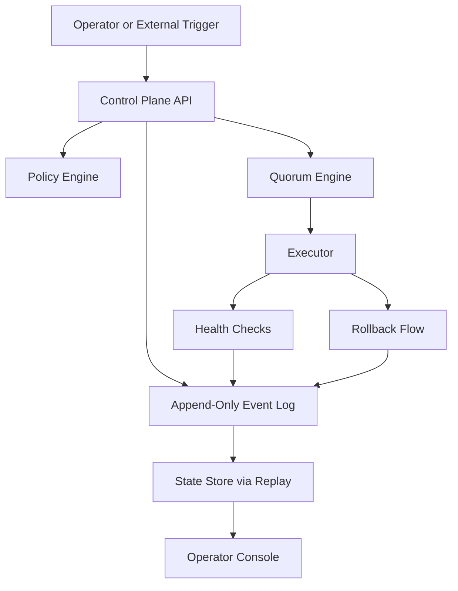
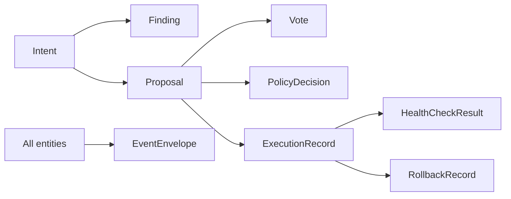
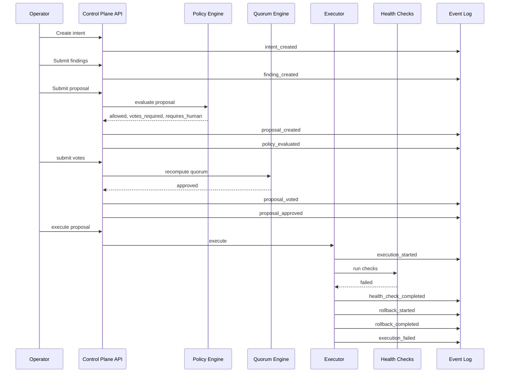

# Architecture

This document describes the POC architecture in a format that is intentionally easy for both humans and LLMs to parse.

## System goal

Quorum coordinates multiple agents that inspect system state, propose actions, reach quorum, and execute safely with verification and rollback.

## Core control loop

```text
observe -> find -> propose -> policy-check -> vote -> approve -> execute -> verify -> rollback-if-needed -> log everything
```

## Main components

1. **Control Plane API**
   - accepts intents, findings, proposals, votes, and execution requests
   - exposes state and event history

2. **Append-Only Event Log**
   - source of truth
   - every state transition becomes an event
   - **tamper-evident hash chain**: each `EventEnvelope` carries `prev_hash` and
     `hash` (sha256 of the canonical JSON of
     `{id, event_type, entity_type, entity_id, ts, payload, prev_hash}`).
     Startup runs `EventLog.verify()` and refuses to boot on a broken chain.
     `GET /api/v1/events/verify` re-walks the chain on demand.
   - replayable

3. **State Store**
   - rebuilds current state from the log
   - used by API and console

4. **Policy Engine**
   - checks whether a proposal is allowed
   - decides whether human approval is required
   - decides required quorum size

5. **Quorum Engine**
   - counts votes
   - marks proposals approved or blocked

6. **Executor**
   - runs an approved proposal
   - evaluates health checks via a registered-kind dispatcher (no subprocess path)
   - triggers rollback when needed

   Supported `HealthCheckKind` values: `always_pass`, `always_fail`, `http`
   (HTTP GET/HEAD probe with expected-status and timeout). Adding a new probe
   requires extending the enum and adding a branch in `services/health_checks.py`
   — proposals cannot inject arbitrary command strings.

7. **Operator Console**
   - shows intents, proposals, votes, execution state, and log events

## Readable architecture diagram



## Data model diagram



## Event flow for an incident rollback



## POC design decisions

### 1. Event log first
The log is the source of truth.
The state store is derived.

### 2. No free-form execution
Execution only happens through a typed proposal.

### 3. Policy before quorum before execution
That ordering is fixed.

### 4. Verification determines success
Execution is not success.
Passing health checks is success.

### 5. Rollback is not optional
A proposal should carry rollback steps or clearly declare why rollback is impossible.

## Extension points

Later layers can plug in here:

- real LLM agent adapters
- GitHub actuators
- Kubernetes actuators
- Terraform actuators
- approval workflows
- durable DB-backed storage
- authenticated operators
- policy DSL
- richer consensus models

## What not to change casually

These are load-bearing:

- append-only event log
- typed proposals
- policy + quorum gating
- health-based success
- rollback as a first-class path
